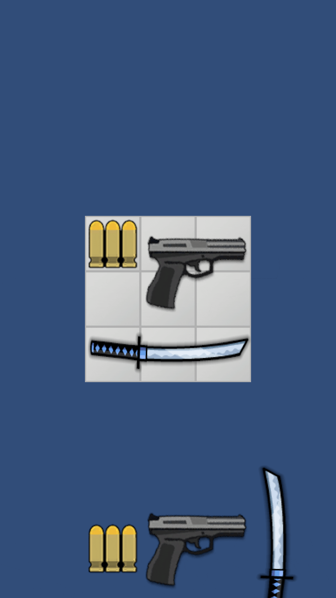

# "Survival Merge by at0m"
#### Not finished

### Description

- Test task: arcade shooter with inventory and merge mechanics
- Technology stack: Zenject, UniRx, UniTask, DOTween.
- Labor costs:
    - In total, the inventory took about <b>3 working days</b> to sell.

#### Flaws

- In the current version, the task is not fully completed due to a lack of free time.
- The inventory system is messy. It requires a small refactoring.

#### Advantage
- The most difficult part has been completed.
- Item rotation has been added, which was not mentioned in the task.
- The ability to set item sizes through the editor has been added.
- Automatic item placement has been added when there is free space in the inventory.

### Download

### Unity versions
- Latest release requires Unity 6.0.50f1  or higher.
- Previously releases should work with older Unity versions.
- Downgrading the project version will cause conflicts with PackageManager and Unity version-dependent packages.

### Gameplay

